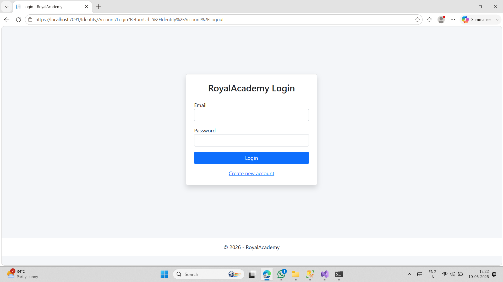
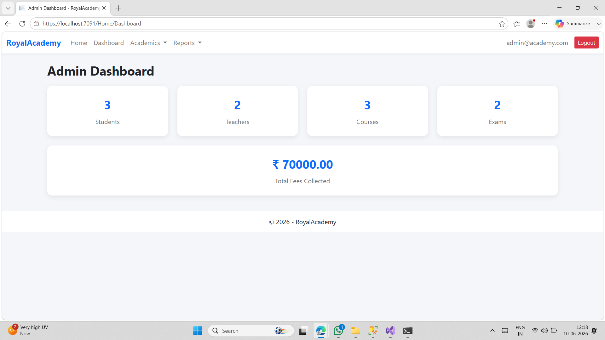
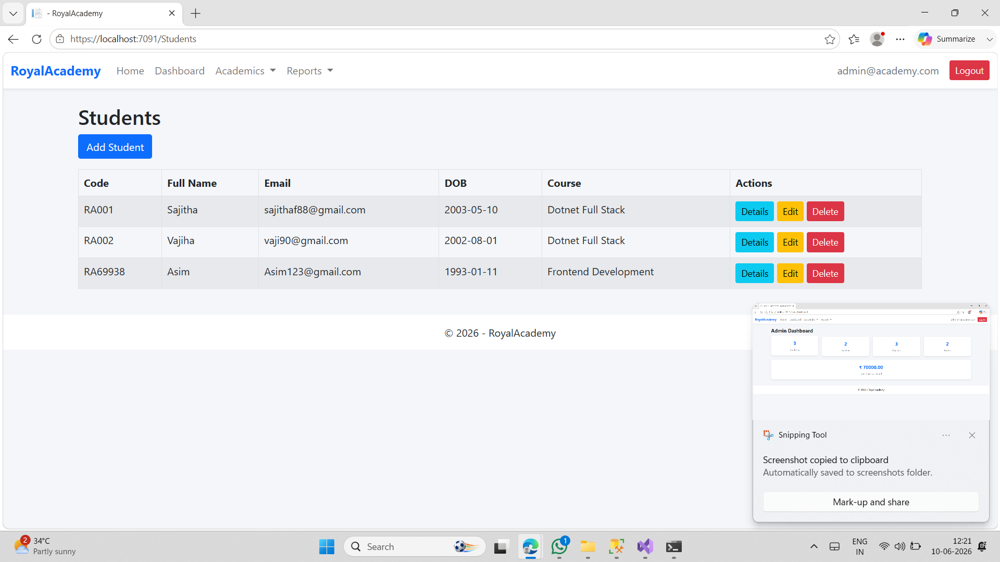
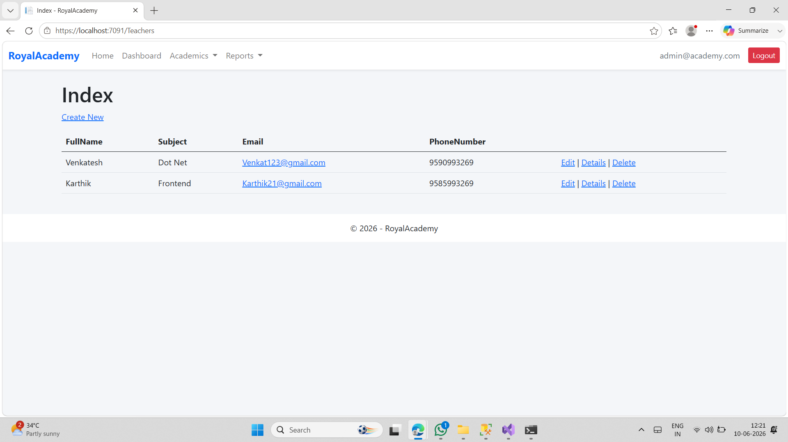
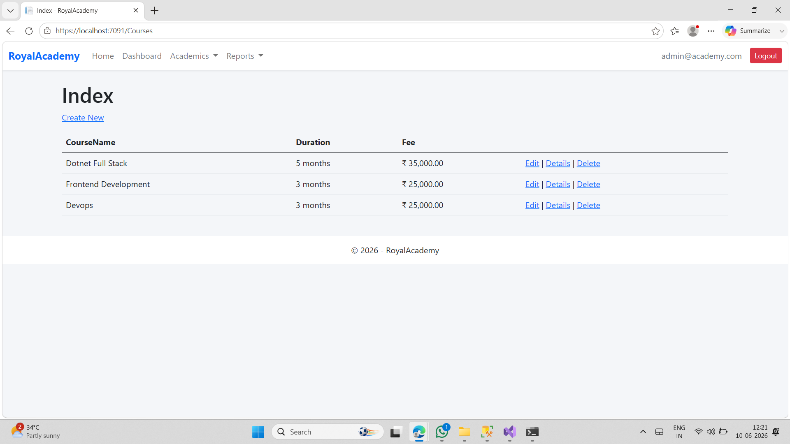
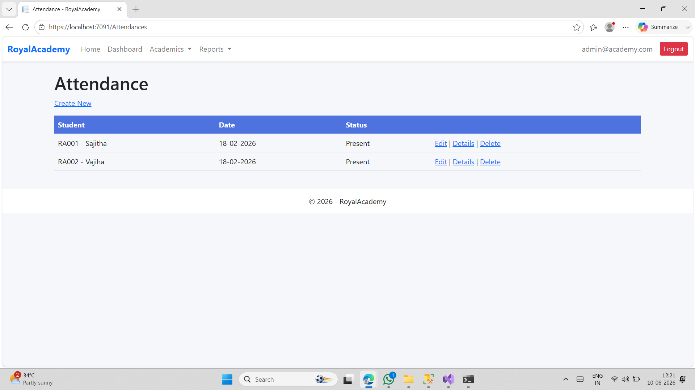
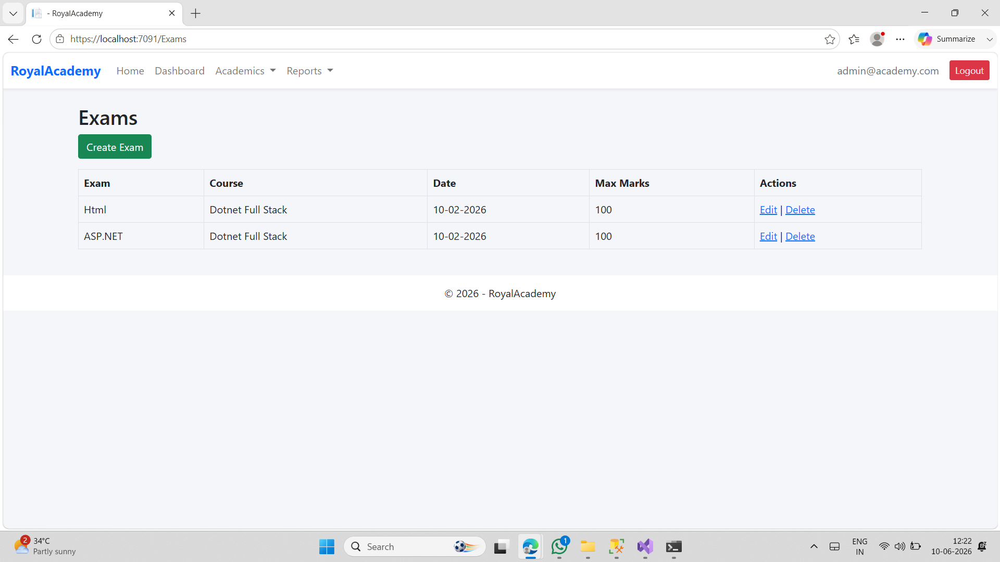
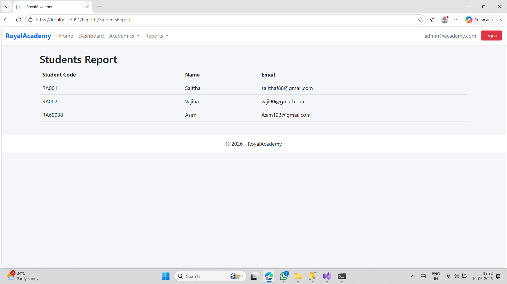
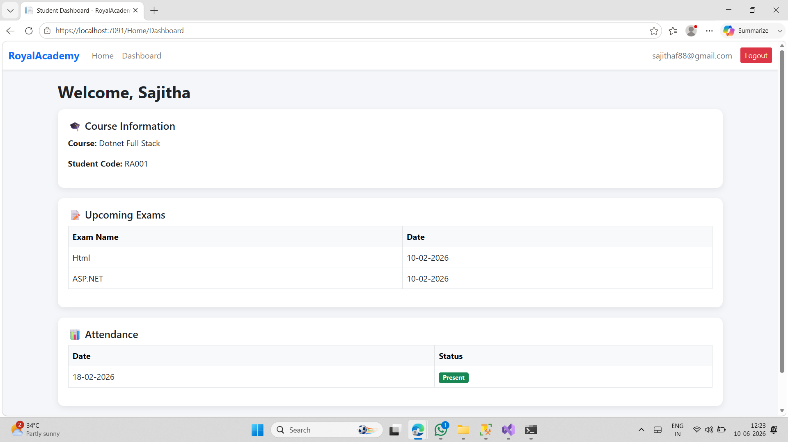

# Royal Academy Management System

## Project Description

Royal Academy Management System is a web-based application developed to manage academy operations efficiently.
The system helps manage students, teachers, courses, attendance, exams, fees, and reports in one platform.

---

## Features

* Student Management
* Teacher Management
* Course Management
* Attendance Tracking
* Exam Management
* Fee Management
* Reports Generation
* Role-Based Authentication
* Admin Dashboard
* Student Dashboard

---

## Technologies Used

* ASP.NET Core MVC
* C#
* Entity Framework Core
* SQL Server
* ASP.NET Identity
* HTML
* CSS
* Bootstrap
* JavaScript

---

## Modules

### Admin Module

* Manage Students
* Manage Teachers
* Manage Courses
* Manage Exams
* Manage Fees
* View Reports
* Dashboard Statistics

### Student Module

* View Attendance
* View Course Details
* View Exams
* Student Dashboard

---

## Default Admin Login

Email: [admin@academy.com](mailto:admin@academy.com)
Password: Admin@123

---

## Database

Database Used: SQL Server

Update database using:

```powershell
Update-Database
```

---

## How to Run the Project

1. Clone the repository
2. Open the project in Visual Studio
3. Update connection string in `appsettings.json`
4. Run migrations
5. Build and run the project

---

## Screenshots

### Login Page



### Admin Dashboard



### Students Module



### Teachers Module



### Courses Module



### Attendance Module



### Exams Module



### Reports Module



### Student Dashboard



---

## Author

Sajitha Fathima
